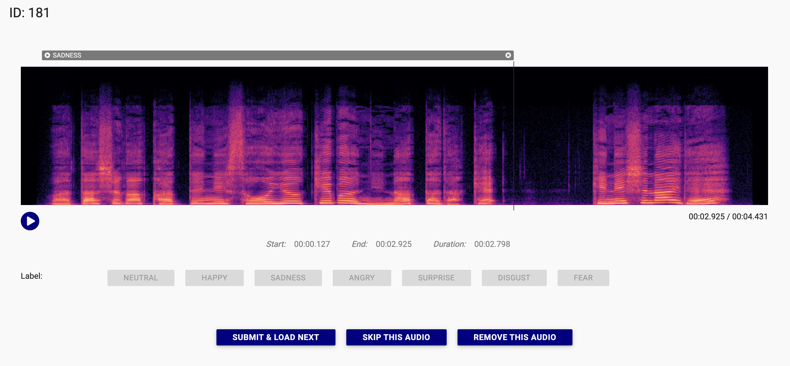

# YAAA

A simple and easy to use audio data annotation tool.

Forked from [audio-annotator](https://github.com/CrowdCurio/audio-annotator).

English | [中文](README.zh.md)



## Usage

### Connect to Backend Server

Edit `index.html` line 43 `var backendUrl = 'http://127.0.0.1:8000';` to your backend address.

You can use our backend server [yaaa-backend](https://github.com/Kare-Udon/yaaa-backend) or create your own.

### Run Web Server

You can use any web server to serve the files. For example, you can use Python's built-in web server:

```bash
python -m http.server
```

We recommand using [miniserve](https://github.com/svenstaro/miniserve) for one-click serving. Just put the binary in the folder and run it.
