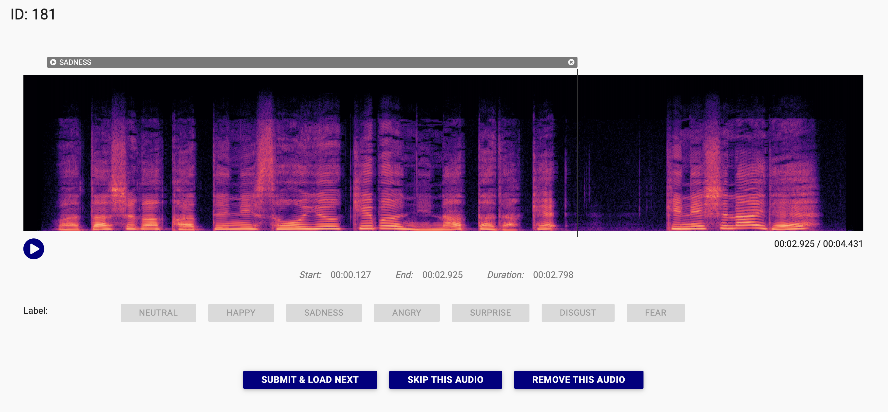

# YAAA

一款简单易用的音频数据标注工具。

Forked from [audio-annotator](https://github.com/CrowdCurio/audio-annotator).

[English](README.md) | 中文



## 使用方法

### 连接到后端服务器

修改 `index.html` 第43行 `var backendUrl = 'http://127.0.0.1:8000';`，填写您的后端地址。

您可以使用我们编写的后端服务器 [yaaa-backend](https://github.com/Kare-Udon/yaaa-backend)，或者自行创建。

### 运行 Web 服务器

您可以使用任何 Web 服务器来提供文件。例如，您可以使用 Python 内置的 Web 服务器：

```bash
python -m http.server
```

我们推荐使用 [miniserve](https://github.com/svenstaro/miniserve) 一键运行。只需将 `miniserve` 二进制文件放在文件夹中并运行即可。
